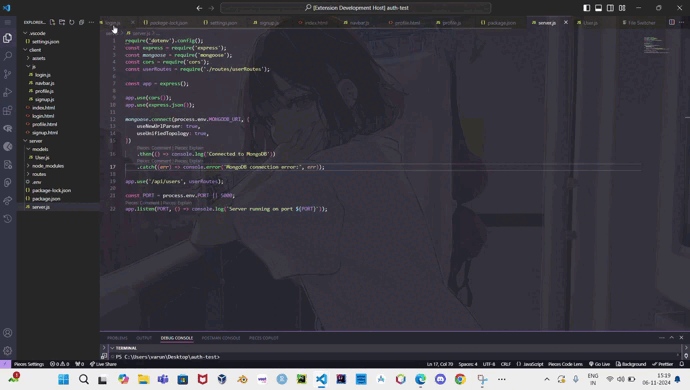

# 🔄 File Switcher for VS Code

[]
[]
[]

A Visual Studio Code extension that enhances your productivity by providing quick and intuitive file switching functionality, similar to Alt+Tab window switching in operating systems.

## ✨ Features

- 🚀 Quick file switching using `Alt + X`
- 📝 Preview file contents before switching
- 🎯 Recent files tracking
- 💫 Smooth transitions with carousel-style navigation
- ⌨️ Keyboard shortcuts for efficient navigation
- 🎨 Syntax highlighting for various programming languages
- 📱 Responsive design for different window sizes

## 🎯 Installation

1. Open VS Code
2. Press `Ctrl+P` / `Cmd+P`
3. Type `ext install file-switcher`
4. Press Enter

## 🎮 Usage

1. Press `Alt + X` to open the file switcher
2. Use arrow keys (`←`, `→`) to navigate between recent files
3. Press `Enter` to select and open a file
4. Press `Esc` to close the switcher



## ⚙️ Technical Implementation

### Core Technologies

- **TypeScript**: Main development language
- **VS Code API**: Extension development
- **WebView API**: UI rendering
- **PrismJS**: Syntax highlighting
- **CSS3**: Modern styling with animations
- **HTML5**: Semantic markup
- **esbuild**: Build tooling

### Key Components

#### 1. File Tracking System

```typescript
vscode.window.onDidChangeActiveTextEditor((editor) => {
  if (editor) {
    const filePath = editor.document.uri.fsPath;
    recentFiles = [
      filePath,
      ...recentFiles.filter((f) => f !== filePath),
    ].slice(0, 10);
  }
});
```

Tracks the 10 most recently accessed files using VS Code's file system API.

#### 2. WebView Panel

```typescript
panel = vscode.window.createWebviewPanel(
  "fileSwitcher",
  "File Switcher",
  vscode.ViewColumn.Active,
  {
    enableScripts: true,
    retainContextWhenHidden: true,
  }
);
```

Creates an interactive UI panel using VS Code's WebView API.

#### 3. File Preview System

```javascript
function getFileLanguage(fileName, languageId) {
  if (languageId) return languageId;
  const ext = fileName.split(".").pop().toLowerCase();
  const langMap = {
    js: "javascript",
    jsx: "jsx",
    ts: "typescript",
    tsx: "tsx",
    // ...
  };
  return langMap[ext] || "plaintext";
}
```

Handles file content preview with syntax highlighting based on file type.

## 🛠️ Development Setup

1. Clone the repository

```bash
git clone https://github.com/VarunSingh19/file-switcher.git
```

2. Install dependencies

```bash
npm install
```

3. Build the extension

```bash
npm run compile
```

4. Run tests

```bash
npm test
```

## 📦 Build Commands

- `npm run compile` - Compile the extension
- `npm run watch` - Watch for changes
- `npm run package` - Create VSIX package
- `npm run lint` - Run ESLint
- `npm run test` - Run tests

## 📄 License

MIT License

## 🤝 Contributing

Contributions are welcome! Please feel free to submit a Pull Request. For major changes, please open an issue first to discuss what you would like to change.

1. Fork the Project
2. Create your Feature Branch (`git checkout -b feature/AmazingFeature`)
3. Commit your Changes (`git commit -m 'Add some AmazingFeature'`)
4. Push to the Branch (`git push origin feature/AmazingFeature`)
5. Open a Pull Request

## 🐛 Known Issues

- None reported yet. Please submit issues on GitHub.

## 📞 Support

If you encounter any problems or have suggestions, please file an issue on the [GitHub repository](https://github.com/VarunSingh19/file-switcher/issues).

## 🙏 Acknowledgments

- VS Code Extension API Documentation
- PrismJS for syntax highlighting
- The VS Code community

---

Made with ❤️ by @VarunSingh19
